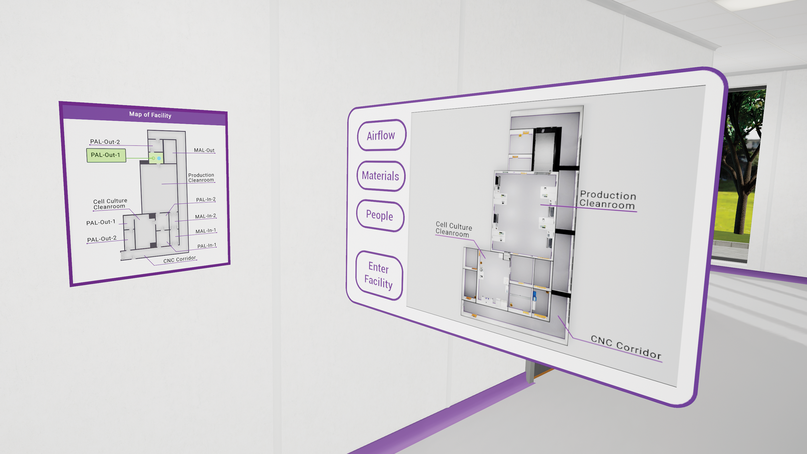

# Controls
Accelerate uses two VR controllers for input. To learn more, visit the Meta [documentation](https://www.meta.com/en-gb/help/quest/272951264509426/).

- **Grip**: Pick up an object. You can pick up objects from a distance by pointing at them and seeing a beam appear. If the beam is visible, pressing grip will bring that object into your hand. Release Grip to drop a held object.
- **Trigger**: Used to interact with interfaces over a distance. Point the controller at an interface, when a beam appears, press Trigger to send a click event. Trigger can also sometimes execute actions through held objects, such as during the mopping exercise in the Cleaning module.
- **B/Y**: Teleport. Press and hold to create a position marker. Release to teleport to the marker location. Point marker at hotspots on the ground to engage.
- **A/X**: Secondary action. Certain objects have actions that can be done by pressing the A/X button, such as opening or closing a held bottle.
- **Menu**: Press and hold for 3 seconds to quit the current module and return to the lobby level.

## Interfaces
The virtual hands can interact with certain interfaces, such as the Facility Cleaning Order or Gowning Item Match activities. Touch the interface with the index finger of the virtual hand to click buttons.

