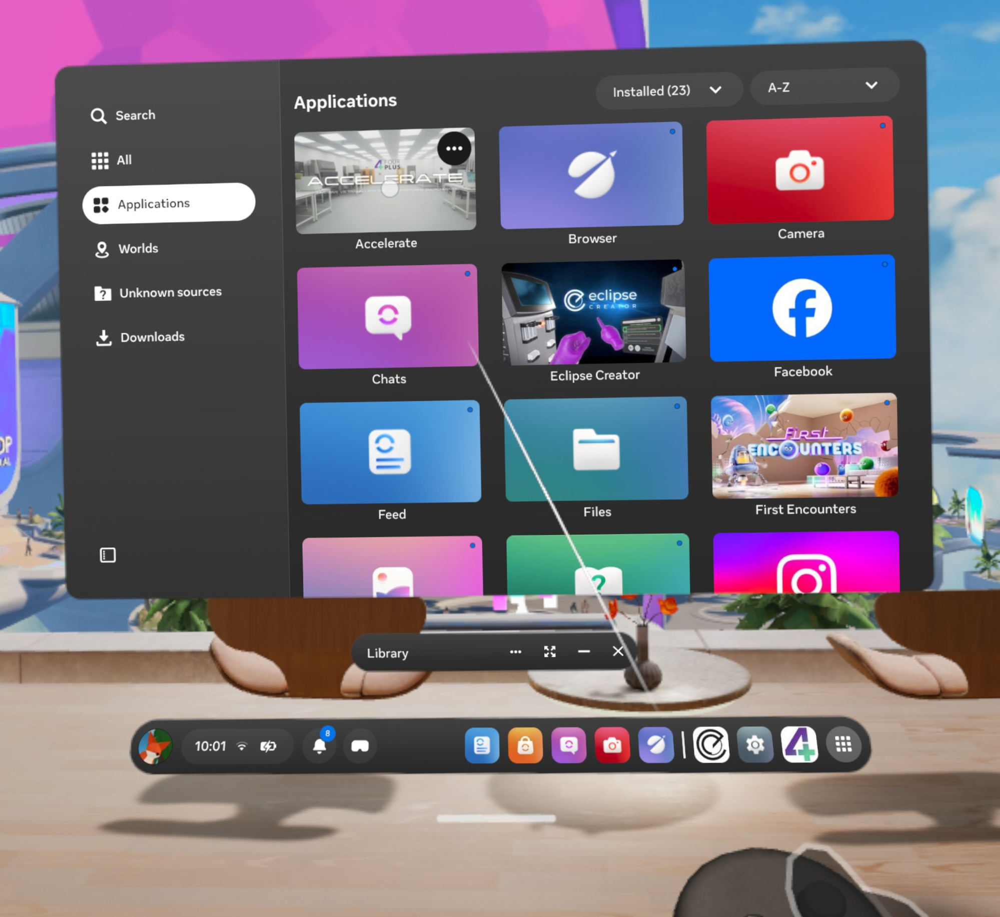
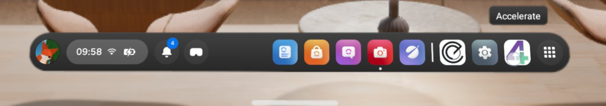
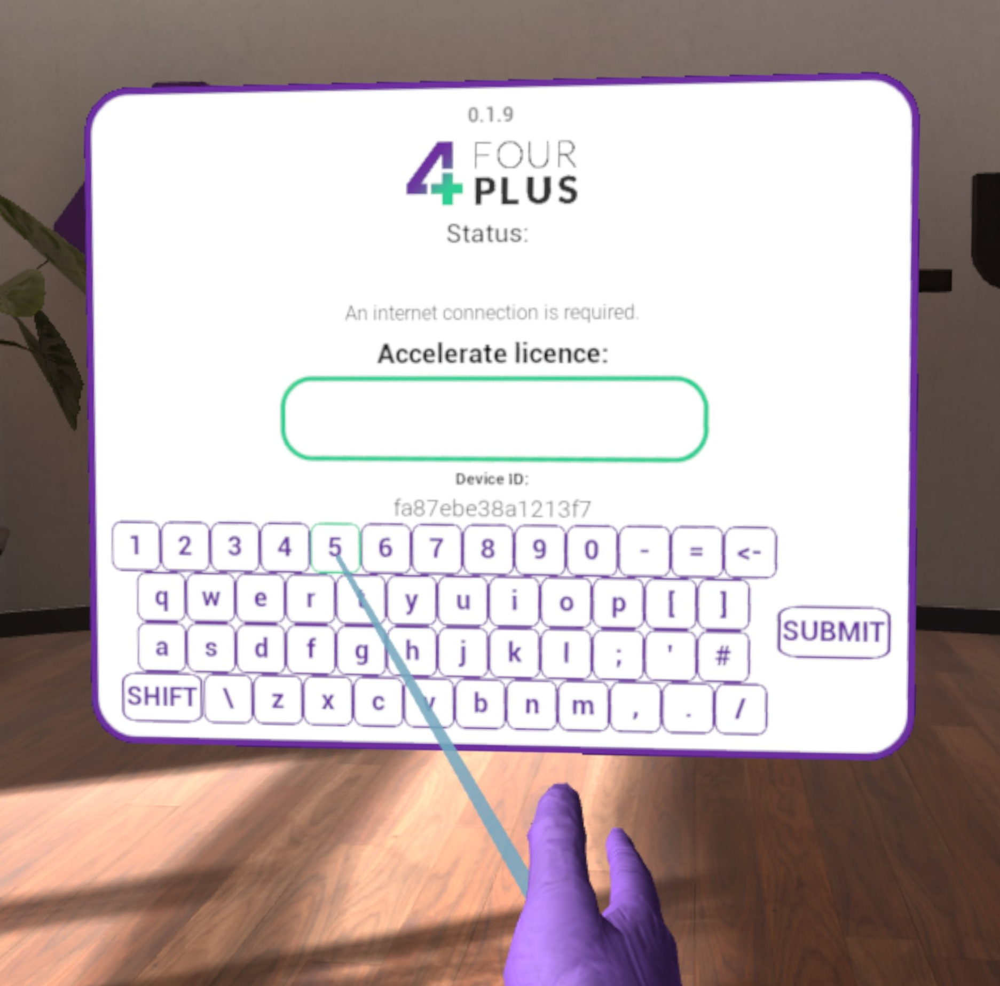
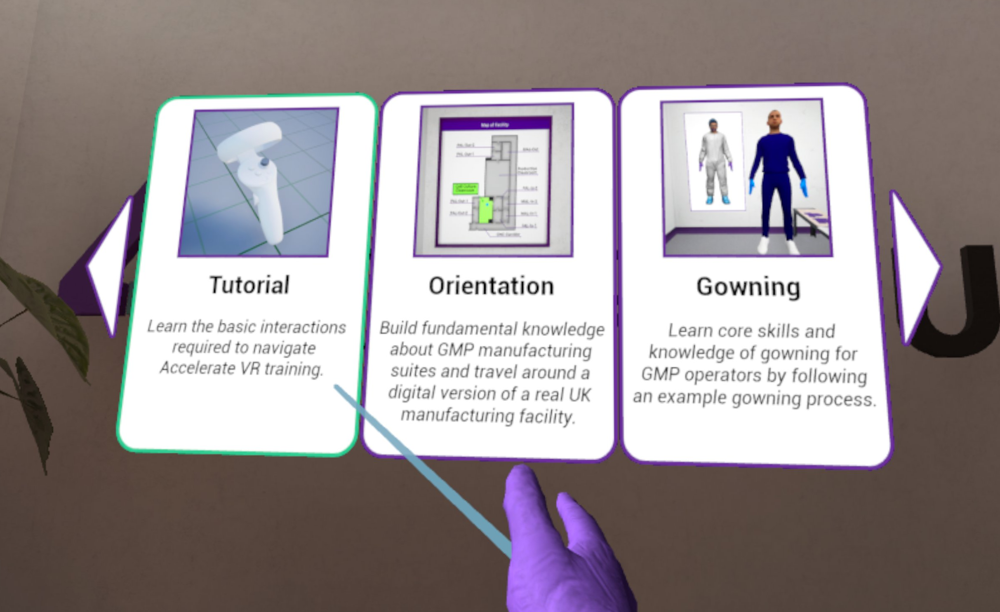

# First time launching Accelerate

## Launch from library
Navigate to your Library on your VR device and select Accelerate to launch it.

## Launch from navbar
If you have launched Accelerate recently, it will appear as a shortcut in the navigation bar. You can select it from there to launch.

## Licence input
Upon first launch, you will be prompted to input a licence key. This will be issued to you by a FourPlus sales representative. If you are unsure of your licence state, or have lost it, please contact <sales@fourplus.co.uk>.

To input your licence, use the virtual keyboard built in the app. Point your controllers at a key and press the trigger button to input a symbol. Once ready, press "submit".

Once a valid licence has been submitted, you will be taken to the module selection screen.

## Play order
It is highly recommended to start with the Tutorial module. This will teach you the Accelerate controls and how to navigate in the experience.

Following the tutorial, the modules are laid out in a suggested order of play, but can be launched and experienced in any order.

Point the controllers at a module panel and press the trigger button to launch it.

