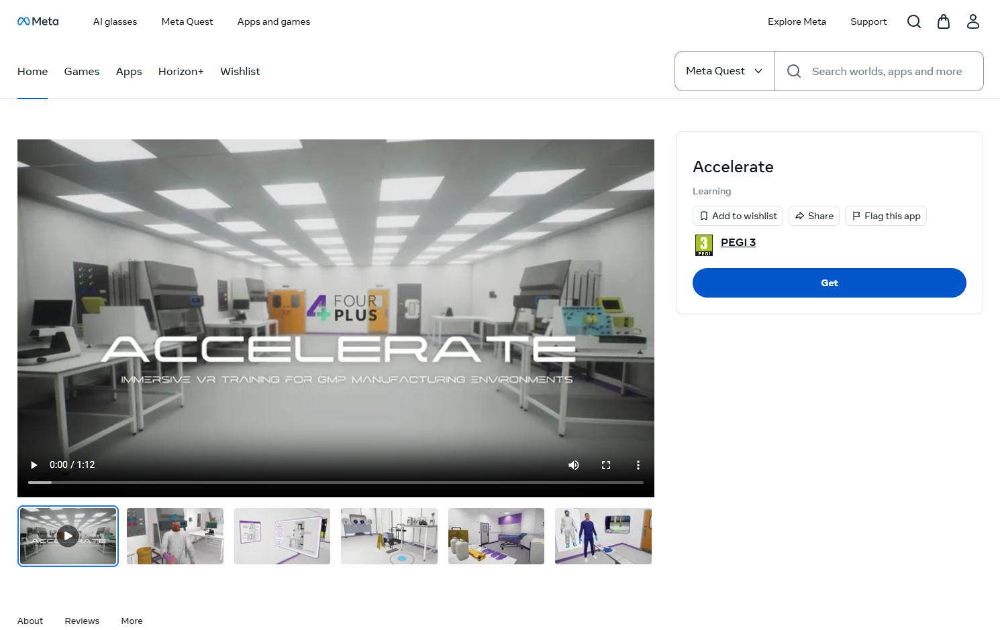
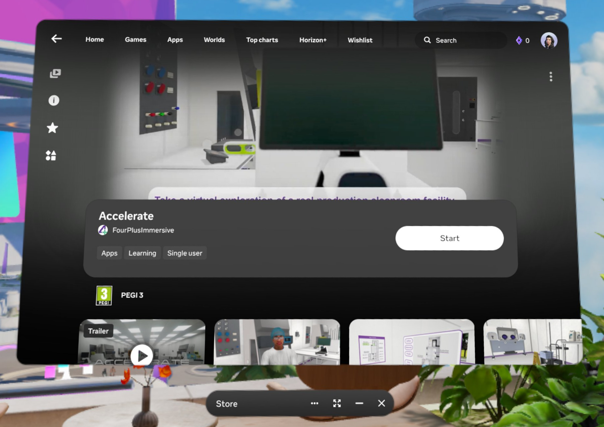

# Accelerate setup guide

## Requirements
Accelerate is accessed through the Meta Horizon Store and is supported for Meta Quest 2+ devices (2, 3, 3S, Pro).

An active internet connection is required.

## Device setup
Set up your VR device and account by following the Meta [guidance](https://www.meta.com/en-gb/help/quest/217690113313574/).

## Adding Accelerate to your library
### Meta Horizon Store on the web
1. Navigate to [Accelerate](https://www.meta.com/en-gb/experiences/accelerate/9188422791221851/) on the Meta Horizon Store.
2. Ensure you are logged into the Meta account used on your VR device.
3. Click "Get" to add Accelerate to your library.
4. Accelerate will now be available to download/play on your VR device.

### Meta Horizon Store on the headset
1. Navigate to the Meta Horizon Store app in your VR device.
2. Search for "Accelerate".
3. Select the app, ensure it's published by FourPlus Immersive.
4. Click "Add to library".

## Installation
1. Navigate to the Library app in your VR device.
2. Find Accelerate and click download.
3. The app will be downloaded and installed.

## Updating
Occasionally when launching Accelerate, you will be prompted to install an update to the app. Once complete, you may resume launching as normal.
